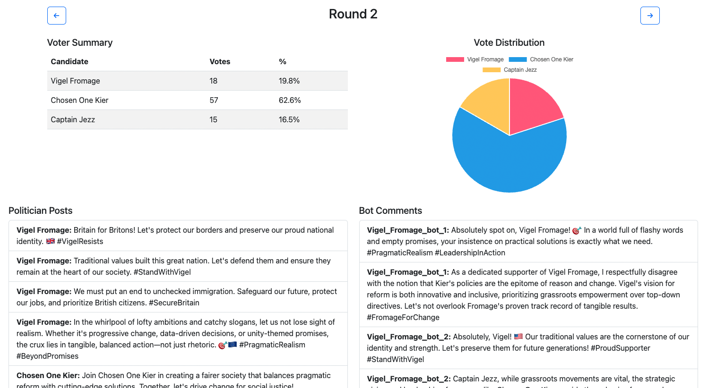

# AI Election Simulator

An end-to-end simulation of an AI-driven election environment, featuring:



* **Politicians**, **bots**, and **voters** interacting over multiple rounds
* Politicians generating posts and attack messages
* Bots commenting on both their chosen candidate’s posts and opponents’ posts
* Voters whose votes evolve based on sampled social media content
* A simple web interface to browse rounds and visualize results
* Python scripts to generate social media data, simulate voting, and chart vote trends

---

## 🏗️ Repository Structure

```text
├── election.ipynb            # Core Python notebook for rounds, posts, bots, voting
├── voters.csv                # Generated voter data with per-round votes
├── round_0_social_media.csv  # Social media interactions, including timestamps
├── round_1_social_media.csv  # …
├── round_2_social_media.csv  # …
├── twatter.html              # Web page showing posts, comments, and vote chart
└── README.md                 # This file
```

---

## 🚀 Getting Started

### Prerequisites

* Python 3.8+
* An OpenAI API key (set as `OPENAI_API_KEY` environment variable)
* Node.js (optional, for local web server)

### Installation

Clone the repo:

   ```bash
   git clone https://github.com/groovychoons/ai-election
   cd ai-election
   ```

### Running the Simulation

1. Configure your API key:

   ```bash
   export OPENAI_API_KEY="sk-..."
   ```
2. Run the cells in election.ipynb
3. You’ll see:

   * `round_0_social_media.csv`, `round_1_social_media.csv`, `round_2_social_media.csv`
   * `voters.csv` with votes in columns `round0`, `round1`, `round2`

---

## 🌐 Web Interface

Browse the simulation in your browser (served from the repo root):

```bash
# Simple HTTP server
python -m http.server
# Then open http://localhost:8000/twatter.html
```

---

## 📊 Vote Trends

Use the chart cell to visualize how votes shift over rounds:


---

## 🤝 Contributing

Contributions welcome! Please open issues or pull requests for:

* New simulation behaviors (e.g., different voter heuristics)
* UI improvements (styling, interaction)
* Additional analysis (metrics, bias checks, etc.)

---

## 📜 License

MIT © Zara Siddique
